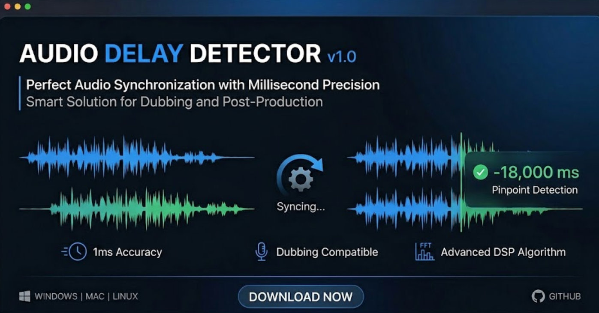
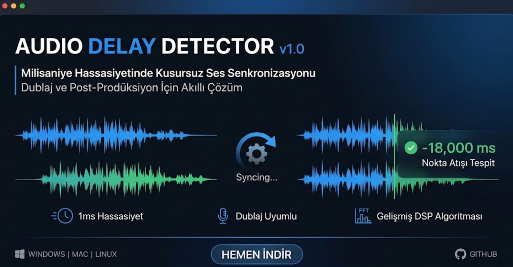

<div align="center">

# 🎵 Audio Delay Detector v1.0

**Precise audio synchronization & dubbing alignment tool**

[](https://python.org)
[](../../releases)
[](LICENSE)
[](../../releases)
[](../../releases)

[**🇬🇧 English**](#-english) · [**🇹🇷 Türkçe**](#-türkçe)

<br>



</div>

---

<a name="-english"></a>

## 🇬🇧 English

> **Audio Delay Detector** calculates the delay (offset) between two audio files with **millisecond precision**. Built for dubbing, post-production, and broadcast workflows — no re-encoding needed.

### ✨ Features

| | Feature | Description |
|---|---|---|
| ⏱️ | **1ms Precision** | Detects sub-frame audio offsets with Micro-Rhythm mapping |
| 🧠 | **7 Analysis Engines** | GCC-PHAT, Envelope, NumPy FFT, SciPy, Multi Feature, 2-Pass & Smart Rhythm |
| 🎯 | **Manual Search** | Select any segment, search ±10 min range in dubbed audio |
| 🎞️ | **Wide Format Support** | MKV, MP4, AVI, MOV, WMV, MP3, FLAC, AAC, AC3, EAC3, DTS, WAV |
| 📊 | **Drift Detection** | Analyzes 3 segments to detect progressive audio drift |
| 🌍 | **Bilingual UI** | Turkish / English with one-click switch |
| 🎬 | **3 Film Modes** | Old Films, Animations, New Films — optimized for each |
| 💾 | **Persistent Config** | Remembers FFmpeg paths and language preference |

### ⚙️ Engines

| Engine | Best For | Description |
|---|---|---|
| **GCC-PHAT** | Identical sources | Phase Transform cross-correlation |
| **Envelope XCorr** | Different languages | RMS energy envelope correlation |
| **NumPy FFT** | General purpose | Fast Fourier Transform based |
| **SciPy** | High accuracy | Scientific signal processing |
| **Multi-Feature** | Complex audio | Onset + HPSS + Chromagram fusion |
| **2-Pass** | Long files | Two-stage refinement |
| **⭐ Smart Rhythm** | Full movies | Smart chunking + RMS rhythm matching |

### 📥 Installation

**Option 1 — Portable EXE (recommended):**

Download `AudioDelayDetector.exe` from [**Releases**](../../releases) — single file, no installation needed.

> ⚠️ Windows SmartScreen may show a warning on first run. Click **"More info" → "Run anyway"**.

**Option 2 — Run from source:**

```bash
git clone https://github.com/MrTOgRaS/AudioDelayDetector.git
cd AudioDelayDetector

pip install numpy scipy librosa pydub soundfile

python AudioDelayDetector.py
```

> [FFmpeg](https://ffmpeg.org/download.html) is optional but recommended for full format support.

### 🚀 Usage

1. Select the **original audio** (main language)
2. Select the **dubbed audio** (secondary language)
3. Choose engine & mode → click **Start**
4. Apply the delay value in your editor (MKVToolNix, Premiere, DaVinci, etc.)

---

<a name="-türkçe"></a>

## 🇹🇷 Türkçe

<div align="center">



</div>

> **Audio Delay Detector**, iki ses dosyası arasındaki gecikmeyi **milisaniye hassasiyetinde** hesaplayan masaüstü aracıdır. Dublaj, post-prodüksiyon ve yayın iş akışları için tasarlanmıştır.

### ✨ Özellikler

| | Özellik | Açıklama |
|---|---|---|
| ⏱️ | **1ms Hassasiyet** | Mikro-Ritim haritalaması ile kare altı gecikme tespiti |
| 🧠 | **7 Analiz Motoru** | GCC-PHAT, Envelope, NumPy FFT, SciPy, Multi Feature, 2-Pass & Akıllı Ritim |
| 🎯 | **Manuel Arama** | Herhangi bir bölümü seç, dublajda ±10 dk aralığında ara |
| 🎞️ | **Geniş Format Desteği** | MKV, MP4, AVI, MOV, WMV, MP3, FLAC, AAC, AC3, EAC3, DTS, WAV |
| 📊 | **Kayma Tespiti** | 3 segmentte ilerleyen ses kaymasını analiz eder |
| 🌍 | **İki Dilli Arayüz** | Türkçe / İngilizce tek tıkla geçiş |
| 🎬 | **3 Film Modu** | Eski Filmler, Animasyonlar, Yeni Filmler |
| 💾 | **Kalıcı Ayarlar** | FFmpeg yolları ve dil tercihi otomatik hatırlanır |

### ⚙️ Motorlar

| Motor | En İyi Kullanım | Açıklama |
|---|---|---|
| **GCC-PHAT** | Aynı kaynaklar | Faz dönüşümlü çapraz korelasyon |
| **Envelope XCorr** | Farklı diller | RMS enerji zarfı korelasyonu |
| **NumPy FFT** | Genel amaç | Hızlı Fourier Dönüşümü tabanlı |
| **SciPy** | Yüksek doğruluk | Bilimsel sinyal işleme |
| **Multi-Feature** | Karmaşık ses | Onset + HPSS + Chromagram birleşimi |
| **2-Pass** | Uzun dosyalar | İki aşamalı iyileştirme |
| **⭐ Akıllı Ritim** | Tam filmler | Akıllı kesitleme + RMS ritim eşleştirme |

### 📥 Kurulum

**Seçenek 1 — Portable EXE (önerilen):**

[**Releases**](../../releases) sayfasından `AudioDelayDetector.exe` dosyasını indirin — tek dosya, kurulum gerektirmez.

> ⚠️ İlk çalıştırmada Windows SmartScreen uyarısı gösterebilir. **"Daha fazla bilgi" → "Yine de çalıştır"** tıklayın.

**Seçenek 2 — Kaynak koddan çalıştırma:**

```bash
git clone https://github.com/MrTOgRaS/AudioDelayDetector.git
cd AudioDelayDetector

pip install numpy scipy librosa pydub soundfile

python AudioDelayDetector.py
```

> [FFmpeg](https://ffmpeg.org/download.html) isteğe bağlıdır ancak tam format desteği için önerilir.

### 🚀 Kullanım

1. **Ana ses** dosyasını seçin (orijinal dil)
2. **Dublaj ses** dosyasını seçin (ikinci dil)
3. Motor ve mod seçin → **Başlat**'a tıklayın
4. Gecikme değerini editörünüzde uygulayın (MKVToolNix, Premiere, DaVinci, vb.)

---

<div align="center">

### 🛠️ Built With

`NumPy` · `SciPy` · `pydub` · `soundfile` · `librosa` · `FFmpeg` · `Tkinter`

---

**Developer:** [Murat Ogras](https://www.mrtogras.com) · [GitHub](https://github.com/MrTOgRaS) ·

**License:** [MIT](LICENSE)

</div>
